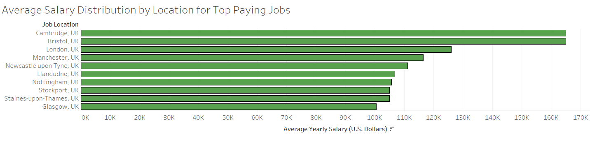
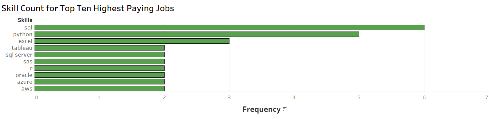

# INTRODUCTION 
📊 Discover the landscape of the UK data job market! This project reveals the top-paying data analyst roles 💰 in the United Kingdom, highlights in-demand skills 📈, and identifies where high salaries meet high demand in data analytics. 

SQL queries used -> [uk_data_analyst_jobs_project_sql](/uk_data_analyst_jobs_project_sql/)
# BACKGROUND
This project originated from my curiosity about the data analyst job market in countries outside of the United States. As a dual citizen of both the United States and the United Kingdom, I was particularly interested in exploring the UK market.

Data comes from [LINK TO CSV FILES](https://drive.google.com/drive/folders/1moeWYoUtUklJO6NJdWo9OV8zWjRn0rjN). The data comprises of around 1 million data related 2023 job postings from around the world, and were collected from various job posting sites (Glassdoor, LinkedIn, etc.)

### **Questions I aimed to explore:**
- What are the highest-paying data analyst jobs?
- Which skills are essential for these top-paying roles?
- What skills are most in demand for data analysts?
- Which skills correlate with higher salaries?
- What are the most optimal skills to learn?
# TOOLS I USED
For my exploration of my datasets, I taught myself and harnessed the power of several important tools:

- **SQL**: Served as the foundation of my analysis, enabling me to query the database and uncover key insights.
- **PostgreSQL**: The selected database management system, well-suited for managing the job posting data.
- **Visual Studio Code**: The tool I used for database management and executing SQL queries.
- **Git & GitHub**: Crucial for version control and sharing SQL scripts and analysis, enabling collaboration and project tracking.
# THE ANALYSIS
Each query for this project was designed to explore each of the questions in the background section.
Heres how I handled each question:

### 1. Highest Paying Data Analyst Jobs
In order to identify the top paying jobs, I filtered data and business analyst positions by average yearly salary and location. I designed the query to only look at job postings where the location ended in "UK" or "United Kingdom".

This query highlights the highest paying jobs in the UK data analyst job market:
```SQL
SELECT
    job_id,
    job_title,
    job_location,
    job_schedule_type,
    salary_year_avg,
    job_posted_date,
    name AS company_name
FROM 
    job_postings_fact
LEFT JOIN
    company_dim ON job_postings_fact.company_id = company_dim.company_id
WHERE
    (job_title_short = 'Data Analyst' OR job_title_short = 'Business Analyst') AND
    (job_location LIKE '%, UK%' OR job_location LIKE '%, United Kingdom%') AND
    salary_year_avg IS NOT NULL
ORDER BY 
    salary_year_avg DESC
LIMIT 
    20;

```
Breakdown of highest earning data analyst positions in 2023:

- Larger cities like London and Manchester, where tech companies are more prevalent, offer a significant majority of the higher-paying jobs.
- The top 20 job listings show salaries ranging from $100,500 to $177,283, which is actually a narrower range than I would have expected.
- A significant majority of the higher-paying positions are in the AI and cybersecurity sectors, with companies like DeepMind and Darktrace leading the list. However, other less tech-focused companies, such as Ocorian, a capital markets firm, and Experian, are also offering top dollar for their data-related roles.


Bar graph visualing the average salary for the top paying data analyst positions in the UK by city
Bar graph illustrating the average salary for the highest-paying data analyst positions in the UK, broken down by city;
**Graph was created using Tableau**
### 2. Skills Required for Highst Paying Jobs
I combined the job postings data with the skills data, which provided insights into the skills that employers prioritize for high-paying positions.
```SQL
WITH top_paying_jobs_uk AS (
    SELECT
        job_id,
        job_title,
        job_title_short,
        job_location,
        salary_year_avg,
        name AS company_name
    FROM 
        job_postings_fact
    LEFT JOIN
        company_dim ON job_postings_fact.company_id = company_dim.company_id
    WHERE
        (job_title_short = 'Data Analyst' OR job_title_short = 'Business Analyst') AND
        (job_location LIKE '%, UK%' OR job_location LIKE '%, United Kingdom%') AND
        salary_year_avg IS NOT NULL
    ORDER BY 
        salary_year_avg DESC
    LIMIT 
        10
)
SELECT 
    top_paying_jobs_uk.*,
    skills
FROM top_paying_jobs_uk
INNER JOIN skills_job_dim ON top_paying_jobs_uk.job_id = skills_job_dim.job_id
INNER JOIN skills_dim ON skills_job_dim.skill_id = skills_dim.skill_id
ORDER BY
    salary_year_avg DESC;
```
Breakdown of Most In-Demand Skills for the Top 10 Highest-Paying Jobs:
- **SQL** tops the list, with a count of 6
- **Python** follows closely with a count of 5
- **Excel** ranks third with a count of 3

Bar graph visualing the count of skills for the top paying data analyst positions;
**Graph was created using Tableau**
### 3. In Demand Skills for Data Analysts 
This query highlighted the skills most commonly sought in UK job postings, guiding attention to high-demand areas.
```SQL
SELECT 
skills,
COUNT(skills_job_dim.job_id) AS demand_count
FROM 
    job_postings_fact
INNER JOIN 
    skills_job_dim ON job_postings_fact.job_id = skills_job_dim.job_id
INNER JOIN
    skills_dim ON skills_job_dim.skill_id = skills_dim.skill_id
WHERE
        (job_title_short = 'Data Analyst' OR job_title_short = 'Business Analyst') AND
        (job_location LIKE '%, UK%' OR job_location LIKE '%, United Kingdom%')
GROUP BY 
    skills
ORDER BY
    demand_count DESC
LIMIT 5;
```
Breakdown of most in demand skills:
- **Excel** and **SQL** lead the list, underscoring their essential role in the data analytics field.
- **Tableau** and **Power BI** rank among the top 5 most demanded skills, highlighting the growing importance of data storytelling.

| Skills   | Demand |
|----------|--------------|
| sql      | 3389         |
| excel    | 3318         |
| power bi | 2221         |
| python   | 1523         |
| tableau  | 1168         |

Table showing the top ten most demanded skills
### 4. Average Salary Associated With Skills
This query determined the average salary for each skill listed in the UK job data for data analysts, highlighting which skills tend to offer higher pay. To ensure accuracy and avoid skewing the data, I only included skills that appeared in the dataset at least five times before calculating their average salary.
```SQL
SELECT
    skills_dim.skills,
    ROUND(AVG(job_postings_fact.salary_year_avg), 0) AS avg_salary
FROM job_postings_fact
INNER JOIN skills_job_dim ON job_postings_fact.job_id = skills_job_dim.job_id
INNER JOIN skills_dim ON skills_job_dim.skill_id = skills_dim.skill_id
WHERE
    (job_postings_fact.job_title_short = 'Data Analyst' OR job_postings_fact.job_title_short = 'Business Analyst') AND
    (job_postings_fact.job_location LIKE '%, UK%' OR job_postings_fact.job_location LIKE '%, United Kingdom%') AND
    job_postings_fact.salary_year_avg IS NOT NULL
GROUP BY
    skills_dim.skills
HAVING
    COUNT(skills_job_dim.skill_id) >= 5
ORDER BY
    avg_salary DESC;
```
Below is an overview of the highest-paying skills for Data Analysts:
- **Azure** boasts the highest average salary at $115,826, highlighting the importance of cloud computing skills.
- **Python**, **SQL**, and **R** are also top earners, demonstrating that traditional data analyst programming languages remain highly valued in the job market.
- **Looker** ranks as the second highest paying skill on average, further emphasizing the value of cloud-related expertise.

| Skills       | Average Salary (U.S. Dollars) |
|--------------|------------|
| azure        | 115826     |
| looker       | 97534      |
| python       | 96619      |
| sql          | 93985      |
| r            | 90473      |
| tableau      | 84362      |
| excel        | 82461      |
| go           | 74125      |
| sas          | 71068      |

Table of the average salary associated with a skill
### 5. Optimal Skills to Gain
Using the insights from the demand and salary data, this query aims to show what skills have the perfect balance of demand and high salary.
```SQL
SELECT
    skills_dim.skill_id,
    skills_dim.skills,
    COUNT(skills_job_dim.job_id) AS demand_count,
    ROUND(AVG(salary_year_avg), 0) AS avg_salary 
FROM
    job_postings_fact
INNER JOIN 
    skills_job_dim ON job_postings_fact.job_id = skills_job_dim.job_id
INNER JOIN
    skills_dim ON skills_job_dim.skill_id = skills_dim.skill_id
WHERE
        (job_title_short = 'Data Analyst' OR job_title_short = 'Business Analyst') AND
        (job_location LIKE '%, UK%' OR job_location LIKE '%, United Kingdom%') AND
        salary_year_avg IS NOT NULL
GROUP BY
    skills_dim.skill_id
HAVING
    COUNT(skills_job_dim.job_id)>5
ORDER BY 
    avg_salary DESC,
    demand_count DESC
```
| Skills  | Demand | Average Salary (U.S. Dollars) |
|---------|--------------|------------|
| python  | 16           | 96619      |
| sql     | 25           | 93985      |
| r       | 7            | 90473      |
| tableau | 8            | 84362      |
| excel   | 19           | 82461      |
| go      | 7            | 74125      |

Table showcasing the most optimal skills for data analysts, ranked by average salary and demand count

Breakdown of the most optimal skills for Data Analysts positons in the UK during 2023:
- **Optimal Programming Languages:** It’s no surprise that Python, SQL, and R are the top three most valuable skills to learn. These fundamental programming languages command an average salary in the 90-thousand-dollar range, highlighting their continued high value despite the strong demand for these skills.
- **Excel Highly Sought After:** Excel ranked second in demand, demonstrating that it remains a highly valuable skill for those entering the data analyst job market.
- **Tableau and Value of Data Visualization:** Tableau ranked as the 4th most optimal skill for UK job postings, with an associated average salary of $84,362. To secure a high-paying data analyst position, combining expertise in business intelligence, data visualization, and programming skills appears to be the most effective strategy.
# WHAT I LEARNED
With this project I used many tools that were relatively new to me
- I have acquired some advanced SQL skills, including table merging, using CTEs, and implementing WITH clauses.
- By connecting my PostgreSQL server with VS Code to create queries, I have become familiar with VS Code and its extensions. Additionally, I have gained more experience with PostgreSQL.
- I used Tableau for the first time to create visuals from my exported SQL query data. This experience helped me become familiar with operating Tableau, and how to connect Tableau to a data source.
# CONCLUSIONS
### Insights Gained:
- **1.** The most in-demand skills in the UK market closely mirror those in the United States. This demonstrates that data analyst skills are highly transferable across different locations.
- **2.** SQL consistently appeared as a required skill for higher-paying data analyst positions, underscoring its importance for those aiming for better compensation.
- **3.** Business intelligence tools like Tableau and Power BI were frequently among the most in-demand and well-paid skills, emphasizing the importance of data visualization and storytelling.
- **4.** More specialized skills like Azure and Looker command the highest average salaries, indicating that more specific skills are highly valued.
- **5.** SQL and Python are the most in-demand and highly compensated skills according to the data, highlighting the value of becoming proficient with these tools.

### Final Thoughts
This project helped me become more comfortable with fundamental data tools like SQL, PostgreSQL, and Tableau. Additionally, it provided insights into which skills to focus on to gain an advantage when job searching. I love the continuous learning aspect of the data analytics field, and being able to learn new tools and apply them to a project has been both fulfilling and useful.
